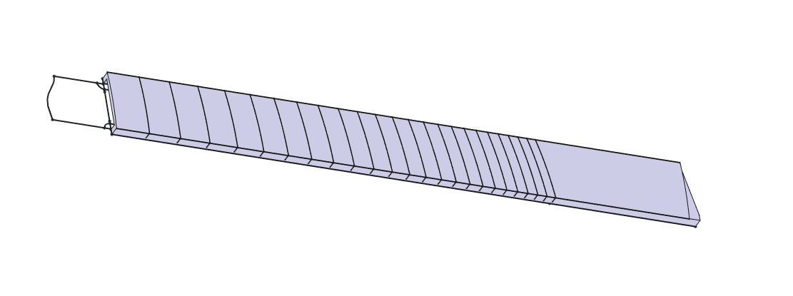
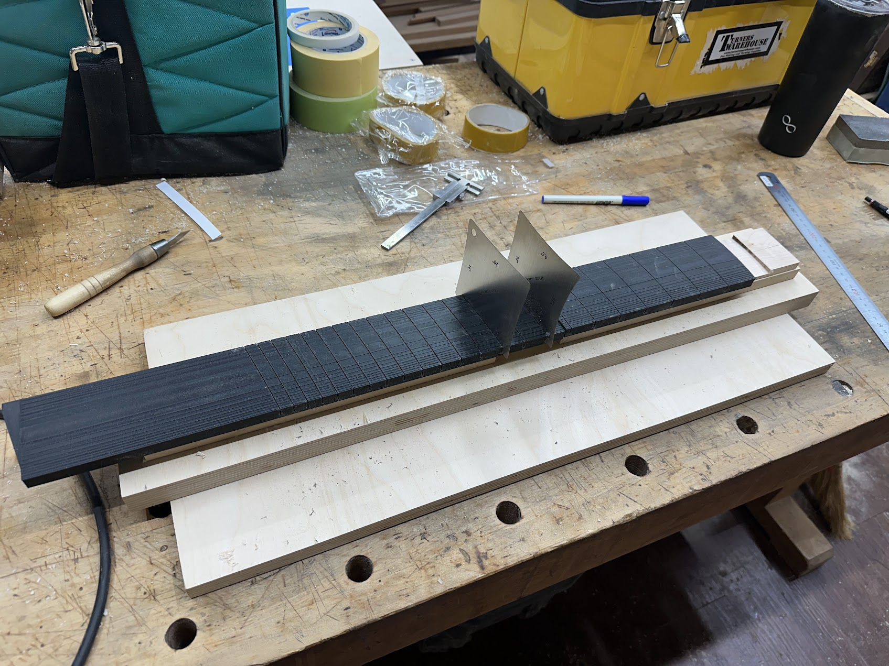

# Guitar Fretboard Slot Guide Jig

This jig was designed using FreeCAD and supports both single scale and multiscale fretboards.  
It is intended to be used by 3D printing the model and using it as a slot-cutting guide for guitar fretboards.

